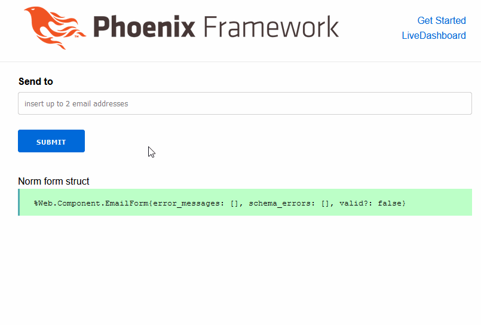

# NormForms

Experiments around [Phoenix.Liveview](https://hexdocs.pm/phoenix_live_view/Phoenix.LiveView.html) and the [Norm](https://hexdocs.pm/norm/Norm.html) library:

## Running

To start your Phoenix server:

  * Install dependencies with `mix deps.get`
  * Install Node.js dependencies with `npm install` inside the `assets` directory
  * Start Phoenix endpoint with `mix phx.server`

Now you can visit [`localhost:4000/email`](http://localhost:4000/email) from your browser.

### If you don't have erlang or elixir installed

Alternatively this repo can use VSCode's [remote-containers](https://marketplace.visualstudio.com/items?itemName=ms-vscode-remote.remote-containers) plugin to create a dev environment. 

### I have linux but I'm not interested in VSCode or Docker

Checkout the [.devcontainer/Dockerfile](.devcontainer/Dockerfile) script (near the end) for how to install nodejs, erlang, elixir and phoenix dependencies on your machine.
